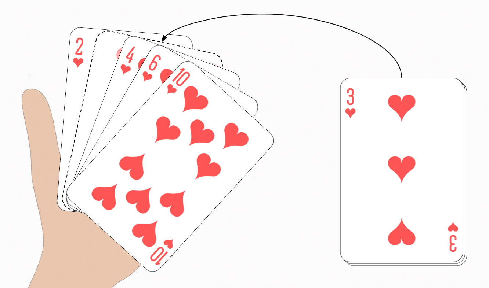

# Insert a card in a list of sorted cards


## Table of Contents
___
- [Problem Statement](https://github.com/Professor-Sathish/GE8151-UNIT-ILLUSTRATIVE-PROGRAMS/blob/master/GuessANumber.md#problem-statement)
- [Python Code](https://github.com/Professor-Sathish/GE8151-UNIT-ILLUSTRATIVE-PROGRAMS/blob/master/GuessANumber.md#python-code)
- [Replit Link](https://github.com/Professor-Sathish/GE8151-UNIT-ILLUSTRATIVE-PROGRAMS/blob/master/GuessANumber.md#replit-link)
- [PythonTutor Link](https://github.com/Professor-Sathish/GE8151-UNIT-ILLUSTRATIVE-PROGRAMS/blob/master/GuessANumber.md#pythontutor-link)

## Problem Statement
___
**Ramesh want to insert the new cards into the sorted cards**
* Insert a card must be in correct position

## Python Code
___
```python
order = {
    'A': 1, '2': 2, '3': 3, '4': 4,
    '5': 5, '6': 6, '7': 7, '8': 8,
    '9': 9, '10': 10,
    'J': 11, 'Q': 12, 'K': 13
}


def insertCard(deck, newCard):
    for card in deck:
        if order[card] > order[newCard]:
            index = deck.index(card)
            deck.insert(index, newCard)
            break
    return deck


deck = ['2', '5', '8', '10', 'J', 'K']  # initial set of cards
print("deck = ", deck)
newCard = input("Enter the new card to be inserted:")  # get the new card
insertCard(deck, newCard)
print(deck)

```
## Replit Link
___
https://cutt.ly/InsertACard


## PythonTutor Link
___

https://cutt.ly/InsertACardVisual


